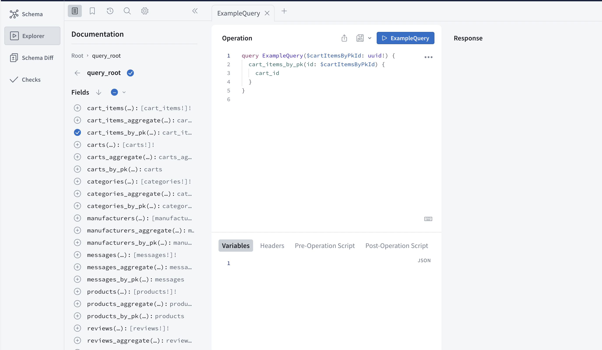
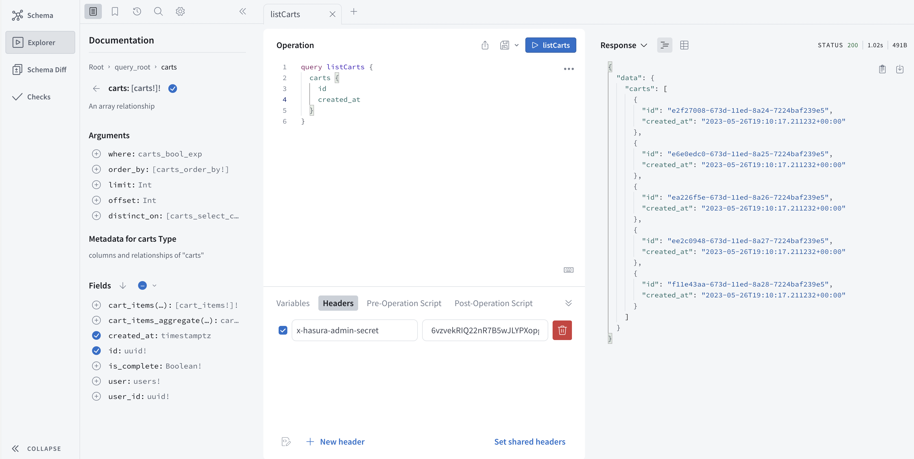
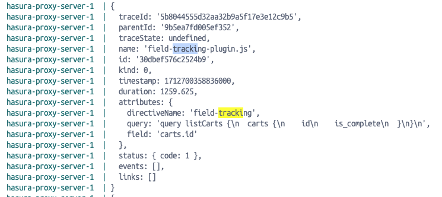

# hasura-proxy-server

Add new features and capabilities to an existing Hasura GraphQL endpoint using the Hasura Proxy Server.

For example, field-level traces, data validation, data profiling, and naming standards enforcement are all simple and easy to do with the hasura-proxy-server.

The HGE is a phenomenal low-code product that lets you generate GraphQL endpoints at a fraction of the cost
of many other tools.

## Why?
The hasura-proxy-server facilitates a special class of plugins to augment Hasura features. Overtime I expect
some of the good ideas may become part of the Hasura offering and/or a plugin architecture will become
available.

This repo includes the hasura proxy server, along with several sample plugins.

[Getting Started](#getting-started) explains your alternatives in demoing it. 

## Prerequisites

- If you want to rebuild from the source:
  - Typescript
  - NodeJS 20+ or Deno
  - Python - for the anomaly detection plugin
alternatively, download docker (you can find it at [Docker.com](https://www.docker.com/products/docker-desktop/) for a quick demo without having to download any additional development tools.
- optionally a Hasura GraphQL Engine login. (If you don't have one head to [Hasura Cloud](http://cloud.hasura.io) and sign-up). Otherwise, we'll use a demo account setup just to illustrate the use of the proxy server.
- optionally a MongoDB login (you can create one here: [MongoDB Atlas](https://www.mongodb.com/lp/cloud/atlas)).

## Getting Started

### Alternative #1: Docker

If you don't have it already, download docker at [Docker.com](https://www.docker.com/products/docker-desktop/).

once docker is installed, navigate to the root of this repo, and:

```shell
docker compose up
```

Connect to http://localhost:8080 - and you should see something like this:



You will be connected to a demo instance of Hasura GraphQL Engine. To verify that it is working, enter this query in the operation window:

```gql
query listCarts {
  carts {
    id
    created_at
  }
}
```

Enter this in the headers area:

```json
{
  "x-hasura-admin-secret": "6vzvekRIQ22nR7B5wJLYPXopg4IdcctCHyevpEI4QFQH7ErgPEL6I540qFwDj60q"
}
```

Click on the query button, and you should see this:



The demo has 9 different plugins installed. One of them is the field-tracking plugin. If you go to your docker container and look in the logs you would see something like this:



You can see that a trace has been created with an attribute that references card.id. Telling you that the field was queried, the query (or context) it was queried, and the authenticated
userid (if there is one).

## Limitations

- Subscriptions are not supported.
- Deno Issues
  - python-shell does not work in Deno - don't use the anomalies plugin

## Plugins

### Overview

There are 8 sample plugins. Plugins can be invoked automatically, or through an operation directive

The plugins are loaded dynamically at runtime. They are referenced in the `.env` file. 
(Deno uses the `.deno.env file`, and the docker image uses `var.env`) in the variables: `PLUGINS`. This allows you
to use the docker image from docker hub with no code changes - but enhance at runtime with additional plugins.

As long as you use the same source code layout, and create a plugin, you can reference it remotely. 
You have to use the same source code layout so that the helper modules you reference
can be found in the docker runtime image, after importing your remote plugin.

Alternatively - if you are using the NodeJS runtime for the proxy server, you can bundle the plugin using `@vercel/ncc`. 
See the sample script for doing this in `package.json/sample:build:plugin`. In this approach you 
have no module dependencies between the proxy server and the plugin.

| Plugin Name                                                     |Address|Invoked By|Purpose|
|-----------------------------------------------------------------|-------|----------|-------|
| Data Validator                                                  |./dist/plugins/validate-plugin.js|@validate|Validates a result set against a JSON Schema|
| Sampler                                                         |./dist/plugins/sample-plugin.js|@sample|Reduces the queried dataset by taking the first, last or random # of elements. Useful for a few scenarios, but an example might be to use the Data Validator plugin combined with Sampler, so that you only retrieve the records that failed the validator.|
| Data Anomaly Detection                                          |./dist/plugins/data-anomalies-plugin/data-anomalies-plugin.js|@anomalies|Identifies records in a queried result that are outliers.|
| [Field Tracking](./src/plugins/field-tracking-plugin/README.md) |./dist/plugins/field-tracking-plugin/field-tracking-plugin.js|automatic|Adds field level traces for all query operations|
| Files                                                           |./dist/plugins/file-plugin/file-plugin.js|@file|Returns various file formats and output formats for a query operation|
| Naming Standards                                                |./dist/plugins/naming-standards-plugin/naming-standards-plugin.js|automatic|Enforces this pattern on query operation names `<verb><Object Type><optional list of adjectives and nouns>`. Provides additional, useful explanation on why a query was made. Can be used for support, audit or LLM prompt engineering|
| Data Profiler                                                   |./dist/plugins/profile-plugin/profile-plugin.js|@profile|Provides various statistical measures for each scalar field in a query.|
| History                                                         |./dist/plugins/query-history-plugin/query-history-plugin.js|@retain or automatic|Keeps a copy of every record returned in a query within a time series database. Used for creating historical dashboards, auditing, training data, undo, etc.|

### MongoDB Trace Exporter

This module will write traces, generated by a plugin to MongoDB. It creates a collection for each operationDirective name,
and then writes each trace as a separate record into the collection. It requires a valid MongoDB connection string environment variable: `MONGODB_CONNECTION_STRING`

You can remove certain records from the MongoDB traces, through the environment variable: `MONGODB_SPAN_ATTRIBUTE_FILTERS`. This is a comma separate list of keys in this format: `<attribute-name>:<attribute-value>`

Any trace which has an attribute with the name and value will be excluded from writing the MongoDB. For example,
`directiveName:validate` would NOT write any records generated by the validate plugin.

### Deno

To support Deno, we create a single source image geared towards Node.js and use `denoify` 
to change the source image to meet Deno requirements. In some cases it is not possible. In those
circumstances you may see a mirror source file - *.deno.ts. That has the deno version of the code.

You may also see some runtime switches where there maybe a code branch that is activated when
the global variable 'Deno' is detected.


