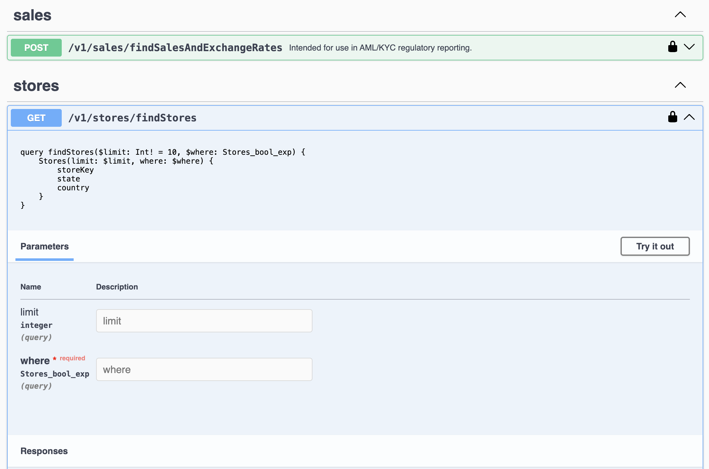

# hasura-proxy-server

Add new features and capabilities to an existing Hasura GraphQL endpoint using the Hasura Proxy Server.

For example, gRPC, JSON-RPC, file formats, field-level traces, data validation, data profiling, and naming standards enforcement are all simple and easy to do with the hasura-proxy-server.

The HGE is a phenomenal low-code product that lets you generate GraphQL endpoints at a fraction of the cost
of many other tools.

## Why?
The hasura-proxy-server facilitates a special class of plugins to augment Hasura features. Overtime I expect
some of the good ideas may become part of the Hasura offering and/or a plugin architecture will become
available.

This repo includes the hasura proxy server, along with several sample plugins.

[Getting Started](#getting-started) explains your alternatives in demoing it and making changes. 

## Prerequisites

- If you want to rebuild from the source:
  - Typescript
  - NodeJS 20+ or Deno
  - Python - for the anomaly detection plugin
- alternatively, 
  - download docker (you can find it at [Docker.com](https://www.docker.com/products/docker-desktop/) for a quick demo without having to download any additional development tools.
- optionally
  - A Hasura GraphQL Engine login. (If you don't have one head to [Hasura Cloud](http://cloud.hasura.io) and sign-up). Otherwise, we'll use a demo account setup just to illustrate the use of the proxy server.
  - A MongoDB login (you can create one here: [MongoDB Atlas](https://www.mongodb.com/lp/cloud/atlas)).

## Getting Started

### Alternative #1: Docker

If you don't have it already, download docker at [Docker.com](https://www.docker.com/products/docker-desktop/).

once docker is installed, navigate to the root of this repo, and:

```shell
docker compose up
```

Connect to http://localhost:8080 - and you should see something like this:

#### Initial Query


You will be connected to a demo instance of Hasura GraphQL Engine. To verify that it is working, enter this query in the operation window:

```gql
query listCarts {
  carts {
    id
    created_at
  }
}
```

Enter this in the headers area:

```json
{
  "x-hasura-admin-secret": "6vzvekRIQ22nR7B5wJLYPXopg4IdcctCHyevpEI4QFQH7ErgPEL6I540qFwDj60q"
}
```

Click on the query button, and you should see this:


The demo has 9 different plugins installed. One of them is the field-tracking plugin. If you go to your docker container and look in the logs you would see something like this:


You can see that a trace has been created with an attribute that references card.id. Telling you that the field was queried, the query (or context) it was queried, and the authenticated
userid (if there is one).

### Alternative #2 - Local NodeJS Debug Setup

```shell
npm install
python -m venv ./.venv
python ./.venv/bin/activate_this.py
pip install -r requirements.txt
npm run node:compile:watch
```
```shell
npm run node:debug
```

Connect to http://localhost:4000 - and you should see something like this:

[See initial query](#initial-query)

### Alternative #3 - Local Deno Debug Setup

One caution. When you switch from NodeJS to Deno and back, you need to
remove node_modules/.deno and re-run npm install.

You may end up with a debug port being left open if you are switching back and forth. A killall node|deno, and or exit and re-enter your IDE.

```shell
npm install
python -m venv ./.venv
python ./.venv/bin/activate_this.py
pip install -r requirements.txt
npm run deno:compile
```
```shell
npm run deno:run
```

Connect to http://localhost:4000 - and you should see something like this:

[See initial query](#initial-query)

## Limitations

- Subscriptions are not supported.
- Deno Issues
  - python-shell does not work in Deno - don't use the anomalies plugin

## Plugins

### Overview

There are 8 sample plugins. Plugins can be invoked automatically, or through an operation directive

The plugins are loaded dynamically at runtime. They are referenced in the `.env` file. 
(Deno uses the `.deno.env file`, and the docker image uses `var.env`) in the variables: `PLUGINS`. This allows you
to use the docker image from docker hub with no code changes - but enhance at runtime with additional plugins.

As long as you use the same source code layout, and create a plugin, you can reference it remotely. 
You have to use the same source code layout so that the helper modules you reference
can be found in the docker runtime image, after importing your remote plugin.

Alternatively - if you are using the NodeJS runtime for the proxy server, you can bundle the plugin using `@vercel/ncc`. 
See the sample script for doing this in `package.json/sample:build:plugin`. In this approach you 
have no module dependencies between the proxy server and the plugin.

| Plugin Name                                             | Address                                                           | Invoked By            | Purpose                                                                                                                                                                                                                                                     |
|---------------------------------------------------------|-------------------------------------------------------------------|-----------------------|-------------------------------------------------------------------------------------------------------------------------------------------------------------------------------------------------------------------------------------------------------------|
| [Data Validator](./src/plugins/validate-plugin/README.md) | ./dist/plugins/validate-plugin.js                                 | @validate             | Validates a result set against a JSON Schema                                                                                                                                                                                                                |
| [Sampler](./src/plugins/sample-plugin/README.md)        | ./dist/plugins/sample-plugin.js                                   | @sample               | Reduces the queried dataset by taking the first, last or random # of elements. Useful for a few scenarios, but an example might be to use the Data Validator plugin combined with Sampler, so that you only retrieve the records that failed the validator. |
| [Data Anomaly Detection](./src/plugins/data-anomalies-plugin/README.md) | ./dist/plugins/data-anomalies-plugin/data-anomalies-plugin.js     | @anomalies            | Identifies records in a queried result that are outliers.                                                                                                                                                                                                   |
| [FieldIntermediate Tracking](./src/plugins/field-tracking-plugin/README.md) | ./dist/plugins/field-tracking-plugin/field-tracking-plugin.js     | automatic             | Adds field level traces for all query operations                                                                                                                                                                                                            |
| Files                                                   | ./dist/plugins/file-plugin/file-plugin.js                         | @file or /gql/:format | Returns various file formats and output formats for a query operation                                                                                                                                                                                       |
| Naming Standards                                        | ./dist/plugins/naming-standards-plugin/naming-standards-plugin.js | automatic             | Enforces this pattern on query operation names `<verb><Object Type><optional list of adjectives and nouns>`. Provides additional, useful explanation on why a query was made. Can be used for support, audit or LLM prompt engineering                      |
| Data Profiler                                           | ./dist/plugins/profile-plugin/profile-plugin.js                   | @profile              | Provides various statistical measures for each scalar field in a query.                                                                                                                                                                                     |
| [History](./src/plugins/query-history-plugin/README.md) | ./dist/plugins/query-history-plugin/query-history-plugin.js       | @retain or automatic  | Keeps a copy of every record returned in a query within a time series database. Used for creating historical dashboards, auditing, training data, undo, etc.                                                                                                |
| [Cluster](./src/plugins/cluster-plugin/README.md)       | ./dist/plugins/cluster-plugin/cluster-plugin.js                   | @cluster              | Groups records into clusters                                                                                                                                                                                                                                |                                                                                                                                                                                                                                                             |

### MongoDB Trace Exporter

This module will write traces, generated by a plugin to MongoDB. It creates a collection for each operationDirective name,
and then writes each trace as a separate record into the collection. It requires a valid MongoDB connection string environment variable: `MONGODB_CONNECTION_STRING`

You can remove certain records from the MongoDB traces, through the environment variable: `MONGODB_TRACE_FILTERS`. 
This is a comma separate list of keys in this format: `<name><op><value>`. 

* name: dot-notated, span field name, 
* op: =, <>, <, >, <=, .+
* value: string, unless is possible to convert to number, i.e. \(0-9,.,-,+)

Any trace which has an attribute with the name and value will be excluded from writing the MongoDB. For example,
`directiveName:validate` would NOT write any records generated by the validate plugin.

### Deno

To support Deno, we create a single source image geared towards Node.js and use `denoify` 
to change the source image to meet Deno requirements. In some cases it is not possible. In those
circumstances you may see a mirror source file - *.deno.ts. That has the deno version of the code.

You may also see some runtime switches where there maybe a code branch that is activated when
the global variable 'Deno' is detected.

### Alternate Transports

#### gRPC

You can use gRPC to communicate with hasura-proxy. Just set the env variable

```GRPC_PORT=50051```

to a valid port value. You can execute a GraphQL query calling the `ExecuteQuery` RPC method.

Just like calling GraphQL on an HTTP POST, you supply an operationName, query, and variables.

It returns the value in same format as standard GraphQL result.

#### JSON-RPC

You can use JSON-RPC to communicate with hasura-proxy. Just set one or both of these env variable

```
JSON_RPC_HTTP_PORT=3330
JSON_RPC_SOCKETS_PORT=3331
```

to a valid port value. You can execute a GraphQL query calling the `query` RPC method.

Just like calling GraphQL on an HTTP POST, you supply an operationName, query, and variables.

JSON-RPC validates on each call - you validate by adding a 'secret' variable equal to the `x-hasura-admin-secret`.

It returns the value in same format as standard GraphQL result.

#### RPC'd Parameterized Queries

Parameterized queries are automatically generated as OpenAPI, gRPC and JSON-RPC endpoints.

Locate parameterized query `.gql ` files in this location `process.env.RESTIFIED_OPS`. 
files must be placed under a `get` or `post` subdirectory. You can also nest the files.
Nested files will attempt to recreate a similar structure in the RPC. For example:

```
/ops
   shopping
     get
       findStores
       findProducts
```

Would, in grpc be placed in a Service named `shoppingService`, with 2 RPC's, 
`findStores` and `findProducts`

A parameterized query file might look like:

```graphql
query findStores($limit: Int! = 10, $where: Stores_bool_exp) {
    Stores(limit: $limit, where: $where) {
        storeKey
        state
        country
    }
}
```

This RPC would have 2 parameters, a required parameter `limit` with a default of value of `10` and a 
where expression. Each query_root has its own customized where predicates, in this case
`Stores_bool_exp` is the class of the where predicate we will parameterize.

When the server starts you will have the following endpoints available:

- http(s)://`SERVER_NAME`:`PORT`/api-docs
  - ex: `http://localhost:4000/api-docs`
  - a Swagger Doc showing all parameterized queries)
  - ex: 
- http(s)://`SERVER_NAME`:`GRPC_PORT`
  - ex: `http://localhost:50051`
  - Retrieve the proto through reflection
- http(s)://`SERVER_NAME`:`JSON_RPC_HTTP_PORT`/`JSON_RPC_BASEPATH`
  - ex: `http://localhost/3330/jsonrpc`
  - Retrieve documentation via reflection (use `https://playground.open-rpc.org/`)
- ws(s)://`SERVER_NAME`:`JSON_RPC_SOCKETS_PORT`
  - ex: `ws://localhost/3331`
  - Retrieve documentation via reflection (use `https://playground.open-rpc.org/`)

Insomnia and Postman both support GRPC and are good for testing RPCs.


