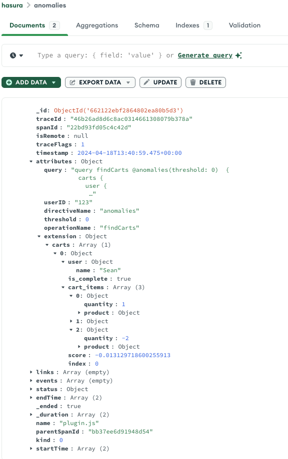

# data-anomalies-plugin

This plugin is really, really simple to invoke. You just set a threshold value -.5 to .5 (suspicious to normal).

It would be interesting to add the result as a value for each query root object and make it a @defer field.
That would be the cleanest way to do it. But support for @defer with Apollo Server is not quite there
yet.

## Usage:

Consider this query:

```graphql
query findCarts {
  carts {
    user {
      name
    }
    is_complete
    cart_items {
      quantity
      product {
        name
        manufacturer {
          name
        }
      }
    }
  }
}
```

Just add the @anomalies directive to the query like this:

```graphql
query findCarts @anomalies(threshold: 0)  {
  carts {
    user {
      name
    }
    is_complete
    cart_items {
      quantity
      product {
        name
        manufacturer {
          name
        }
      }
    }
  }
}
```

When you run the query you will get this added to the extensions section of the payload.

```json
{
  "extensions": {
    "anomalies": {
      "carts": [
        {
          "user": {
            "name": "Sean"
          },
          "is_complete": true,
          "cart_items": [
            {
              "quantity": 1,
              "product": {
                "name": "Sticker Sheet",
                "manufacturer": {
                  "name": "Hasura Merch Co."
                }
              }
            },
            {
              "quantity": 2,
              "product": {
                "name": "Dark Furry Logo Tee",
                "manufacturer": {
                  "name": "Hasura Tee Co."
                }
              }
            },
            {
              "quantity": -2,
              "product": {
                "name": "Dark Furry Logo Tee",
                "manufacturer": {
                  "name": "Hasura Tee Co."
                }
              }
            }
          ],
          "score": -0.013129718600255913,
          "index": 0
        }
      ]
    }
  }
}
```

## Options

The plugin can optionally write the anomaly trace
to a mongodb collection, to simplify reporting. In order to write to MongoDB a valid
MongoDB connection string must be provided as an environment variable named: `MONGODB_CONNECTION_STRING`

## Parameters

```graphql
@anomalies(thresold: Int!)
```

| Name      | Type   | Purpose                                                                                     |
|-----------|--------|---------------------------------------------------------------------------------------------|
| threshold | Float! | This is the only required field. It should be a number from -.5 to .5 (suspicios to normal) |

## Traces

Will create traces in this format:

```json
{
  "traceId": "613e0c408d95bbb3c7187c5738b796e4",
  "parentId": "74001af6355a3f1a",
  "name": "plugin.js",
  "id": "b5934e8e11081696",
  "kind": 0,
  "timestamp": 1713445848197000,
  "duration": 7419182.709,
  "attributes": {
    "query": "query findCarts @anomalies(threshold: 0)  {  carts {    user {      name    }    is_complete    cart_items {      quantity      product {        name        manufacturer {          name        }      }    }  }} ",
    "userID": "123",
    "directiveName": "anomalies",
    "threshold": 0,
    "operationName": "findCarts",
    "anomalies-carts": "[{\"user\":{\"name\":\"Sean\"},\"is_complete\":true,\"cart_items\":[{\"quantity\":1,\"product\":{\"name\":\"Sticker Sheet\",\"manufacturer\":{\"name\":\"Hasura Merch Co.\"}}},{\"quantity\":2,\"product\":{\"name\":\"Dark Furry Logo Tee\",\"manufacturer\":{\"name\":\"Hasura Tee Co.\"}}},{\"quantity\":-2,\"product\":{\"name\":\"Dark Furry Logo Tee\",\"manufacturer\":{\"name\":\"Hasura Tee Co.\"}}}],\"score\":-0.013129718600255913,\"index\":0}]"
  },
  "status": {
    "code": 1
  },
  "events": [],
  "links": []
}

```

Note the extensions attribute. There will be a single trace for each query. Each root query will have an attribute with suspicious records in a stringified JSON.

## MongoDB Trace Log

If you have setup the MongoDB trace exporter, anomalies will be recorded like this:



## Related Plugins

[sample-plugin](../sample-plugin/README.md). When evaluating a large dataset, and the sole interest is in understanding errors, you can sample the
original dataset to a smaller sample record set using this plugin, while still evaluating the entire dataset.

[field-tracking-plugin](../field-tracking-plugin/README.md). This plugin is automatically invoked.

