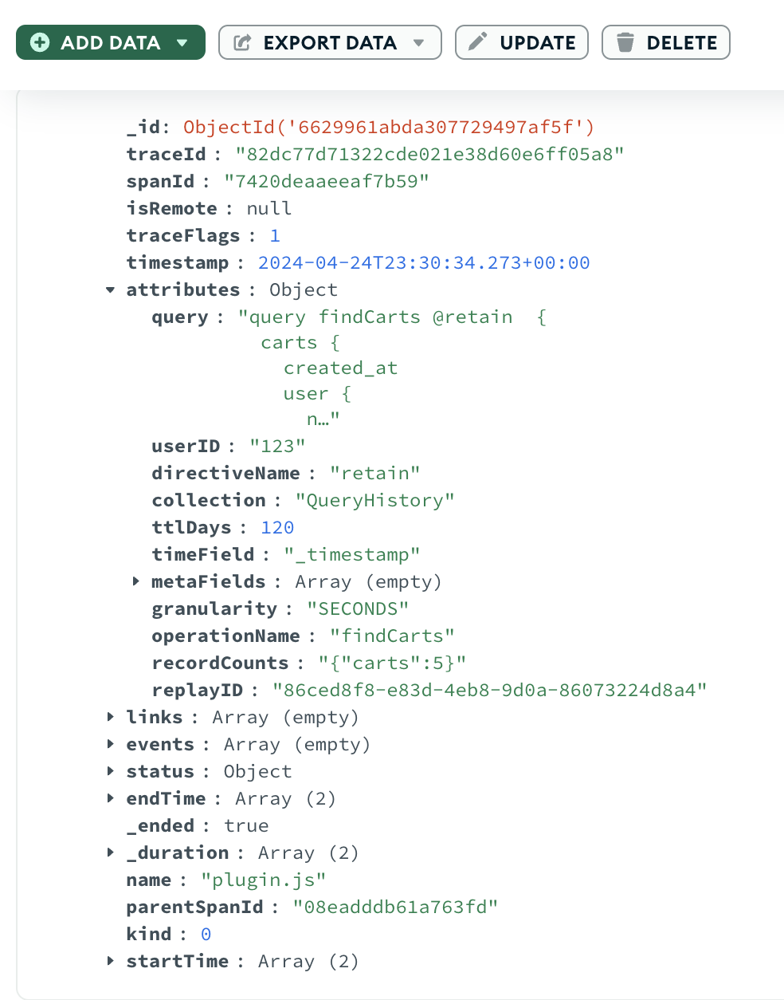

# query-history-plugin

This plugin does require any parameters. You can invoke it with @retain

It would be interesting to add the result as a value for each query root object and make it a @defer field.
That would be the cleanest way to do it. But support for @defer with Apollo Server is not quite there
yet.

## Usage:

Consider this query:

```graphql
query findCarts {
  carts {
    user {
      name
    }
    is_complete
    cart_items {
      quantity
      product {
        name
        manufacturer {
          name
        }
      }
    }
  }
}
```

Just add the @retain directive to the query like this:

```graphql
query findCarts @retain  {
  carts {
    user {
      name
    }
    is_complete
    cart_items {
      quantity
      product {
        name
        manufacturer {
          name
        }
      }
    }
  }
}
```

When you run the query you will get this added to the extensions section of the payload.

```json
{
  "extensions": {
    "resultsRetained": {
      "recordCounts": {
        "carts": 5
      },
      "collection": "QueryHistory",
      "ttlDays": 120,
      "replayID": "36de1116-ab59-42d4-8d47-d73844d9e84a"
    }
  },}
```

## Options

The plugin can optionally write the anomaly trace to a mongodb collection, to simplify reporting. In order to write to MongoDB a valid
MongoDB connection string must be provided as an environment variable named: `MONGODB_CONNECTION_STRING`

## Parameters

```graphql
@retain(
collection: String = "QueryHistory",
replayID: timestamp,
replayFrom: timestamp,
replayTo: String,
deltaKey: String,
ttlDays: Float = 120,
timeField: String = "_timestamp",
metaField: [String!],
granularity: Granularity = SECONDS
)
```

| Name        | Type        | Purpose                                                                                                                                                                                                                                                                                  |
|-------------|-------------|------------------------------------------------------------------------------------------------------------------------------------------------------------------------------------------------------------------------------------------------------------------------------------------|
| collection  | String      | A MongoDB collection name to track this query. Defaults to 'QueryHistory'                                                                                                                                                                                                                |
| ttlDays     | Float       | Expiration time in days for query results. Defaults to 120 days. This can only be changed after the first creation of the collection through MongoDB                                                                                                                                     |
| timeField   | String      | Use a field name in your query for bucketing by time. Will default to the time of the query.                                                                                                                                                                                             |
| metaField   | [String!]   | The operation name and field names are by default part of the metadata fields for the time collection. You can optionally include additional fields to add to the metadata. The metadata is used to generate the deltas and your choices could impact retrieval times and storage costs. |
| replayID    | String      | A UUID (aka replayID) is returned in the extensions when you use @retain. If you use this same value as the replayID it will replay the original query results, rather than querying the datastore                                                                                       |
| replayFrom  | timestamp   | An optional date time as an RFC string - to retrieve historical results based on the operation name. This defines the lower bound.                                                                                                                                                       |
| replayTo    | timestamp   | An optional date time as an RFC string - to retrieve historical results based on the operation name. This defines the upper bound.                                                                                                                                                       |
| deltaKey    | string      | An optional field name to be used to compute deltas when retrieving historical results using replayTo/replayFrom.                                                                                                                                                                        |
| granularity | GRANULARITY | Defaults to "SECONDS", "MINUTES" or "HOURS" can also be used. Improves overall processing and storage if the frequency of data is similar to granularity                                                                                                                                 |

## Traces

Will create traces in this format:

```javascript
trace = {
    traceId: '82dc77d71322cde021e38d60e6ff05a8',
    parentId: '08eadddb61a763fd',
    traceState: undefined,
    name: 'plugin.js',
    id: '7420deaaeeaf7b59',
    kind: 0,
    timestamp: 1714001433153000,
    duration: 1119525.708,
    attributes: {
        query: 'query findCarts @retain  {\n' +
            '  carts {\n' +
            '    created_at\n' +
            '    user {\n' +
            '      name\n' +
            '    }\n' +
            '    is_complete\n' +
            '  }\n' +
            '}',
        userID: '123',
        directiveName: 'retain',
        collection: 'QueryHistory',
        ttlDays: 120,
        timeField: '_timestamp',
        metaFields: [],
        granularity: 'SECONDS',
        operationName: 'findCarts',
        recordCounts: '{"carts":5}',
        replayID: '86ced8f8-e83d-4eb8-9d0a-86073224d8a4'
    }
```

## MongoDB Trace Log

If you have setup the MongoDB trace exporter, retain will be recorded like this:



## Related Plugins

[sample-plugin](../sample-plugin/README.md). When retaining a large dataset, and the sole interest is in retaining the data, you can sample the
original dataset to a smaller sample record set using this plugin, while still retaining the entire dataset.

[field-tracking-plugin](../field-tracking-plugin/README.md). This plugin is automatically invoked.

## Design Considerations

The data retention is performed asynchronously. While it will likely
be saved there is no guarantee.

This is to allow the original dataset to be returned without blocking on
the save to DB.
